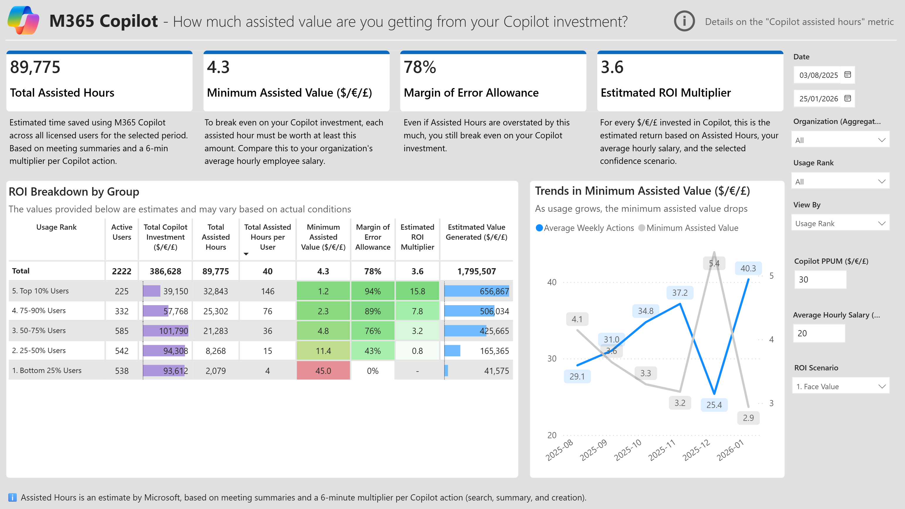
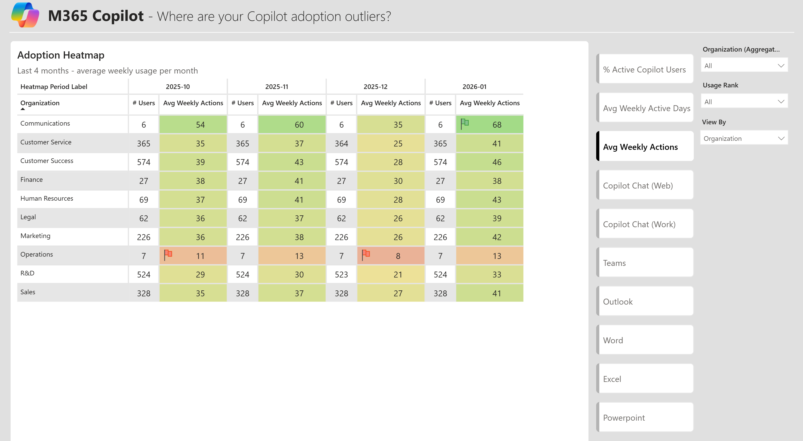
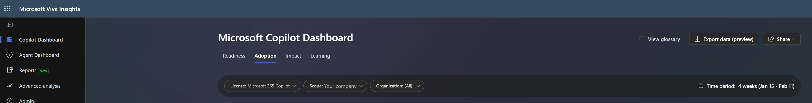

# M365 Copilot — Adoption & Impact Report (Lite Version)

A ready-to-use Power BI template (.pbit) to measure **Microsoft 365 Copilot adoption, usage patterns, and estimated business impact** across your organization.

### 📥 [Download the Template (.pbit)](M365%20Copilot%20-%20Adoption%20and%20Impact%20Report%20(Lite%20version).pbit)

---

## 📊 What This Report Covers

### 1. 📈 Adoption Overview
*How is your Copilot adoption trending across user segments?*

Start here. Get the big picture: how many users are licensed, how many are actually using Copilot, and how that's trending month over month. Each column shows the average weekly Copilot actions for that month. Usage is broken down by organization and by usage tier (Bottom 25% through Top 10%) so you can see whether adoption is broad or concentrated.

---

### 2. 💼 Assisted Value (ROI)
*Is your Copilot investment paying off?*

Now that you know who's using Copilot, see what it's worth. This page estimates the total time saved (Assisted Hours), calculates how much each assisted hour needs to be worth to break even, and shows the estimated ROI multiplier. The breakdown by usage tier reveals where value is concentrated — and where the investment isn't paying back yet. Use the **ROI Scenario** toggle to adjust assumptions and stress-test the analysis.

---

### 3. 🔍 Most Popular Features
*What are the top users doing that others aren't?*

Spoiler: **prompting**. This page compares the Bottom 50% and Top 25% of users side by side. You'll see that top users aren't just using Copilot more — they're using it differently, with significantly more Chat (work) and Chat (web) prompts. The treemap breakdown shows exactly which features drive the gap. Use the **App Selector** toggle to deep dive into feature usage for each app.

> **Note:** For Chat (web) and Chat (work), the data available today only tells us *how many* prompts were submitted — not *what kind*. The other apps (Teams, Outlook, Word, Excel, PowerPoint) do have more detailed feature breakdowns. However, Microsoft is previewing a richer categorization for Chat in the Copilot Dashboard under **Adoption > Adoption by app > Copilot Chat (work)**, breaking prompts into "Ask and find", "Catch up", "Draft and brainstorm", and "Other".
>
> 

---

### 4. 📊 Adoption Heatmap
*Where in the organization are the outliers — good or bad?*

Finally, zoom into the last 4 months to spot which teams are pulling ahead and which are falling behind. Each column shows one month, with the monthly average of weekly usage — smoothing out week-to-week noise so you can focus on real trends. Toggle between metrics (active users, active days, weekly actions, or per-app usage) to find the pockets of high adoption you can learn from — and the lagging teams that need enablement.

---

<strong>🔌 Getting Started</strong>

The template **auto-detects** which data source you're using and adjusts calculations accordingly.

### Step 1 — Get your data

#### Copilot Dashboard Export (CSV) — Primary use case

The easiest way to get started. Download the CSV export from the [Microsoft 365 Admin Center > Copilot Dashboard](https://admin.microsoft.com/) — no Viva Insights license required.

**The trade-off:** the Dashboard export doesn't include Microsoft's native "Copilot assisted hours" metric. To still give you ROI insights, this template **recalculates Assisted Hours** using [Microsoft's published formula](https://learn.microsoft.com/en-us/viva/insights/org-team-insights/copilot-dashboard#details-on-the-copilot-assisted-hours-metric). The result is within ~3-4% of the native value.

**How to export:**
1. Go to the [Microsoft Copilot Dashboard](https://admin.microsoft.com/) → **Adoption** tab
2. Click **Export data (preview)** in the top right
3. Save the CSV to a known location on your machine

#### Viva Insights Custom Person Query (CSV or DirectQuery) — Advanced

This template is also compatible with a custom person query from [Viva Insights Advanced Analyst](https://analysis.insights.cloud.microsoft/) that includes all Copilot metrics. This gives you Microsoft's actual Assisted Hours metric — no recalculation needed.

However, if you have Viva Insights access, the [**Super User Adoption Report**](https://github.com/microsoft/decodingsuperusage) is likely a better fit — it goes deeper into super user patterns, adoption journeys, and behavioral impact.

**How to export:**
1. Go to [Viva Insights Advanced Analyst](https://analysis.insights.cloud.microsoft/)
2. Create a **Custom Person Query** and include **all Copilot metrics** (Copilot actions, active days, enabled days, meeting summaries, chat prompts, etc.)
3. Export as CSV **or** note the Partition ID and Query ID for DirectQuery

### Step 2 — Open the template

1. Download the `.pbit` file from this repository
2. Double-click to open in **Power BI Desktop**
3. When prompted for parameters:

| Parameter | Value |
|-----------|-------|
| **SourceType** | `CSV` (for file import) or `DirectQuery` (for Viva Insights connector) |
| **CSV** | Full file path to your `.csv` file (e.g. `C:\Downloads\MyExport.csv`) — only needed for CSV mode |
| **PartitionID** | Your Viva Insights Partition ID — only needed for DirectQuery mode |
| **QueryID** | Your Viva Insights Query ID — only needed for DirectQuery mode |

4. Click **Load** — the data will refresh automatically

#### Configure Slicers

Once loaded, adjust the report slicers to fit your organization:

- **Average Hourly Salary** — used for ROI calculations
- **Copilot PPUPM** — your per-user per-month license cost
- **Confidence Scenario** — penalty factor for Assisted Hours estimates

---

<strong>🧮 How Assisted Hours Work</strong>

**Copilot assisted hours** is Microsoft's estimate of the time saved using M365 Copilot. It accounts for meeting hours summarized or recapped, plus a time-saving multiplier for each Copilot action (searches, summaries, and creations). For the full methodology, see [Microsoft's documentation](https://learn.microsoft.com/en-us/viva/insights/org-team-insights/copilot-dashboard#details-on-the-copilot-assisted-hours-metric).

**Two sources, two levels of accuracy:**

| | Copilot Dashboard Export | Viva Insights Query |
|---|---|---|
| **Assisted Hours** | Recalculated by this template using Microsoft's published formula | Native metric computed by Microsoft — **source of truth** |
| **Accuracy** | ~3-4% variance from native values | Exact |
| **Why the difference?** | The Dashboard CSV doesn't include the assisted hours metric, so we reconstruct it from the individual action columns | Viva Insights computes it server-side with access to the full dataset |

If precision matters for your ROI analysis, use a Viva Insights custom person query. The Dashboard export is a great starting point that gets you 96-97% of the way there.

---

## 🔗 Related Templates & Tools

- [Super User Adoption Analysis](https://github.com/microsoft/DecodingSuperUsage) — Deep dive into super user patterns (soon to be released as a tweaked official Insights report)
- [AI-in-One Dashboard](https://github.com/microsoft/AI-in-One-Dashboard) — Unified AI analytics
- [GitHub Copilot Impact](https://github.com/microsoft/GitHubCopilotImpact) — Developer Copilot analytics

---

## 📝 License

This project is licensed under the [MIT License](LICENSE).

---

## 💬 Feedback

Found a bug or have a feature request? Contact [opecheux@microsoft.com](mailto:opecheux@microsoft.com).
